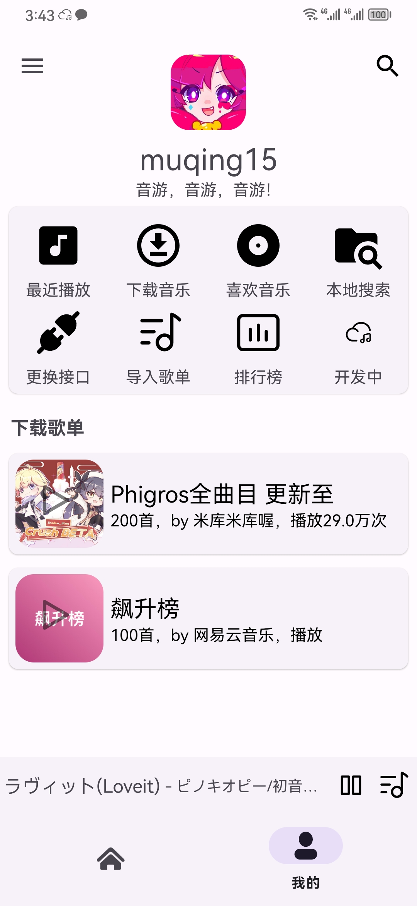
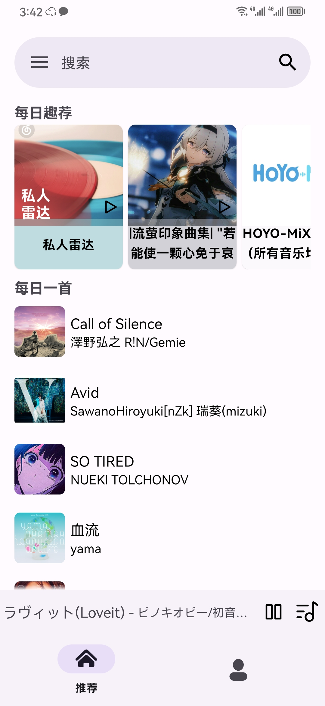
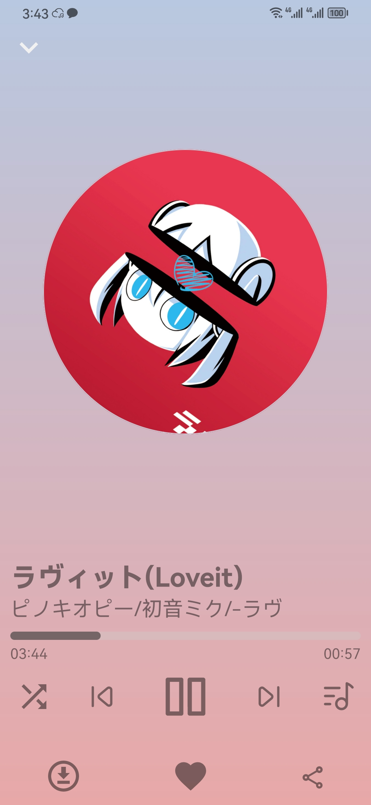

## 简介
一个对接网易云的音乐播放器
* 内置集成作者自己写的歌词Lrc组件支持单行歌词和多行歌词支持悬浮窗歌词。
* 内置适配Android13的通知栏 (不完善)
* 对接了网易云的歌单，歌曲，搜索，二维码登录等其余功能。
* main.java-内api变量是网易云SDK后台服务器地址(可变更)

## 重置计划
    我们使用media3作为播放器核心
    更好的本地播放支持，支持多种格式的音乐播放
    我们（可能）会放弃 基于https://github.com/Binaryify/NeteaseCloudMusicApi后端解析
    我们会添加网易云音乐7天会员领取通道（限名额）
    会让UI交互更加方便，直接
## 截图 (过时)

<!--suppress CheckImageSize -->






## 在使用中有任何问题，欢迎反馈给我，可以用以下联系方式跟我交流
 * QQ:1966944300

## 后台
 * Github: [网易云音乐 API](https://github.com/Binaryify/NeteaseCloudMusicApi)

## 关于
在兴趣的驱动下,写一个`免费`的东西，有欣喜，也还有汗水，希望你喜欢我的作品，同时也能支持一下。


## 修改JAR的包
```javascript
[//]: # (主要修改内容MD3化)
com.github.QuadFlask:colorpicker:0.0.15
[//]: # (歌词做全局变量给悬浮窗歌词)
'com.github.wangchenyan:lrcview:2.2.1'
...